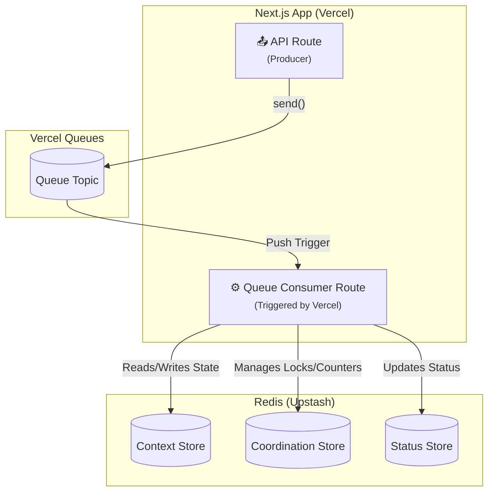

# Runtime Adapter: Vercel (Queues & Redis)

[](https://www.npmjs.com/package/@flowcraft/vercel-adapter)

This adapter provides a fully serverless solution for running distributed workflows on Vercel. It uses **Vercel Queues** for event-driven job queuing and **Redis** (e.g., Upstash via Vercel Marketplace) for state persistence and coordination.

## Installation

You will need the adapter package, the Vercel Queues SDK, and `ioredis`.

```bash
npm install flowcraft @flowcraft/vercel-adapter @vercel/queue ioredis
```

## Architecture

This adapter is designed for serverless execution. There is no persistent worker — each job is processed by a Vercel Function triggered by the queue.



## Infrastructure Setup

Before running, you need to provision the following resources:

- A **Vercel Queues topic** (created automatically when first used).
- A **Redis instance** (e.g., Upstash Redis via Vercel Marketplace).

### Vercel Queues Configuration

Configure the queue consumer trigger in `vercel.json`:

```json
{
	"functions": {
		"app/api/workflow-worker/route.ts": {
			"experimentalTriggers": [{ "type": "queue/v2beta", "topic": "flowcraft-jobs" }]
		}
	}
}
```

## Consumer Usage

The adapter is designed for serverless execution. Each queue message triggers a Vercel Function that processes a single job.

```typescript
// app/api/workflow-worker/route.ts
import { handleCallback } from '@vercel/queue'
import Redis from 'ioredis'
import { VercelQueueAdapter, VercelKvCoordinationStore } from '@flowcraft/vercel-adapter'

const redis = new Redis(process.env.UPSTASH_REDIS_URL!)

const coordinationStore = new VercelKvCoordinationStore({ client: redis })

const adapter = new VercelQueueAdapter({
	redisClient: redis,
	topicName: 'flowcraft-jobs',
	coordinationStore,
	runtimeOptions: {
		blueprints: {
			/* your blueprints */
		},
		registry: {
			/* your node implementations */
		},
	},
})

export const POST = handleCallback(async (message) => {
	await adapter.handleJob(message)
})
```

## Starting a Workflow (Producer)

A client starts a workflow by setting the initial state in Redis and sending the first job(s) to the queue topic.

```typescript
// app/api/workflows/start/route.ts
import { analyzeBlueprint } from 'flowcraft'
import { send } from '@vercel/queue'
import Redis from 'ioredis'

export async function POST(req: Request) {
	const { blueprint, initialContext } = await req.json()
	const runId = crypto.randomUUID()

	const redis = new Redis(process.env.UPSTASH_REDIS_URL!)

	// 1. Set initial context in Redis
	const contextPrefix = 'flowcraft:context:'
	await redis.set(`${contextPrefix}${runId}:blueprintId`, blueprint.id, 'EX', 86400)
	await redis.set(
		`${contextPrefix}${runId}:blueprintVersion`,
		blueprint.metadata?.version || 'null',
		'EX',
		86400,
	)

	// 2. Set initial status
	await redis.set(
		`flowcraft:status:${runId}`,
		JSON.stringify({
			status: 'running',
			lastUpdated: Math.floor(Date.now() / 1000),
		}),
		'EX',
		86400,
	)

	// 3. Analyze blueprint for start nodes
	const analysis = analyzeBlueprint(blueprint)

	// 4. Enqueue start jobs
	for (const nodeId of analysis.startNodeIds) {
		await send('flowcraft-jobs', { runId, blueprintId: blueprint.id, nodeId })
	}

	return Response.json({ runId })
}
```

## Reconciliation

The adapter includes a utility to find and resume stalled workflows by querying Redis.

### Usage

```typescript
import { createVercelReconciler } from '@flowcraft/vercel-adapter'
import Redis from 'ioredis'

const redis = new Redis(process.env.UPSTASH_REDIS_URL!)

const reconciler = createVercelReconciler({
	adapter,
	redisClient: redis,
	statusKeyPrefix: 'flowcraft:status:',
	stalledThresholdSeconds: 300, // 5 minutes
})

// Run this periodically (e.g., via a cron job or scheduled Vercel Function)
async function reconcile() {
	const stats = await reconciler.run()
	console.log(`Reconciled ${stats.reconciledRuns} of ${stats.stalledRuns} stalled runs.`)
}
```

## Key Components

- **`VercelQueueAdapter`**: The main adapter class for serverless execution via Vercel Queues. Exposes `handleJob()` for per-invocation processing.
- **`VercelKvContext`**: An `IAsyncContext` implementation for storing workflow state in Redis.
- **`VercelKvCoordinationStore`**: An `ICoordinationStore` implementation for distributed locks and counters using Redis.
- **`createVercelReconciler`**: A factory function to create the workflow reconciliation utility.
